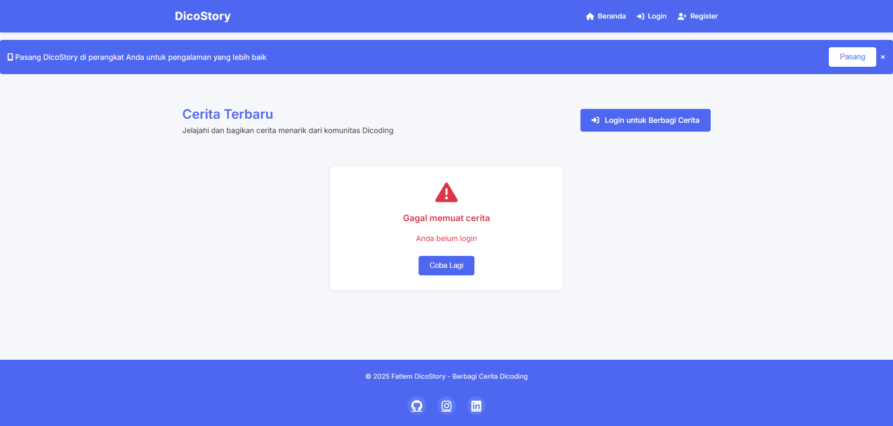
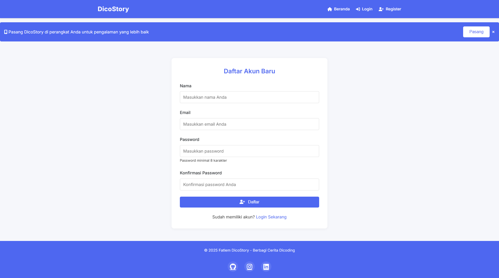
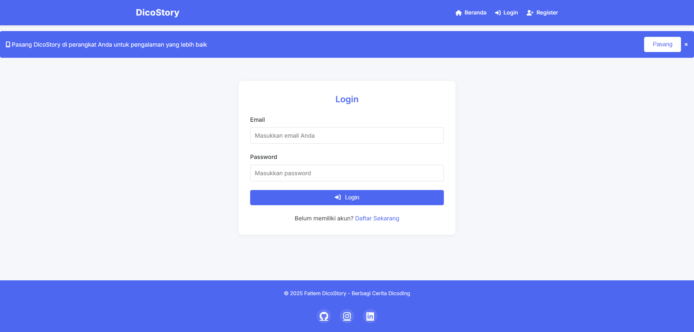
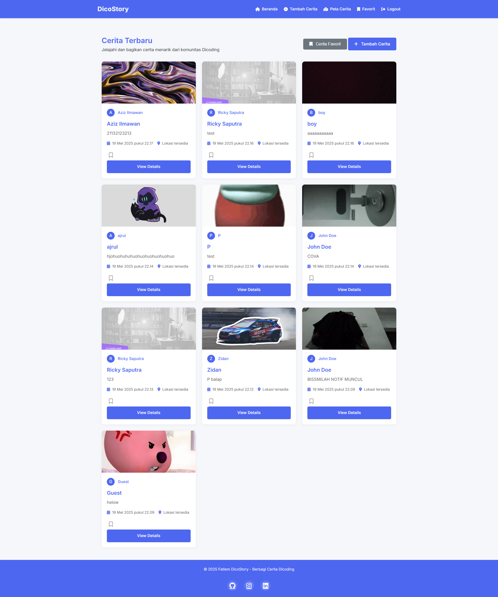
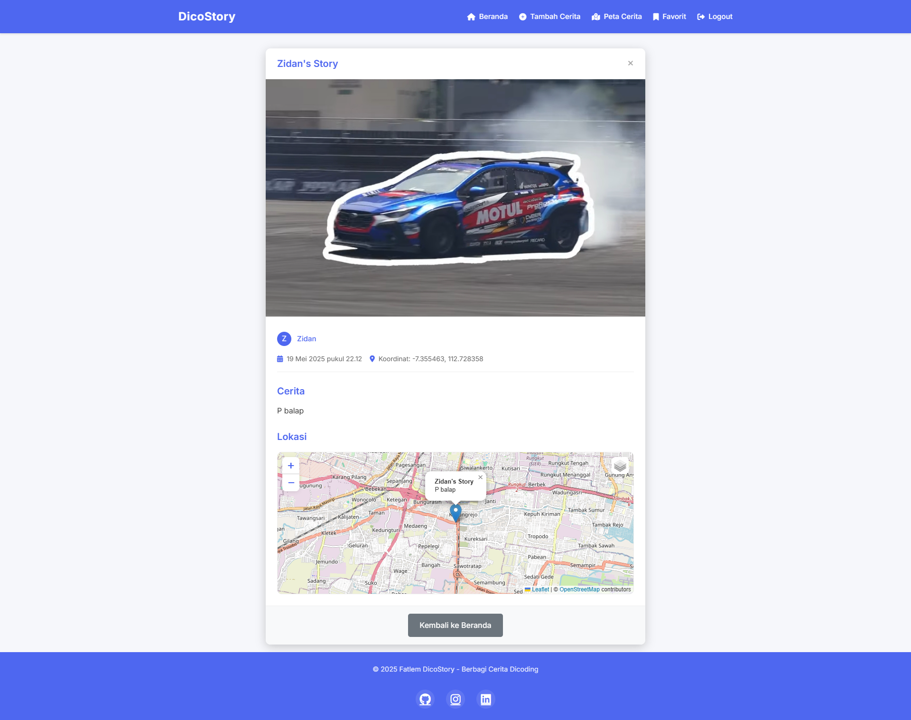
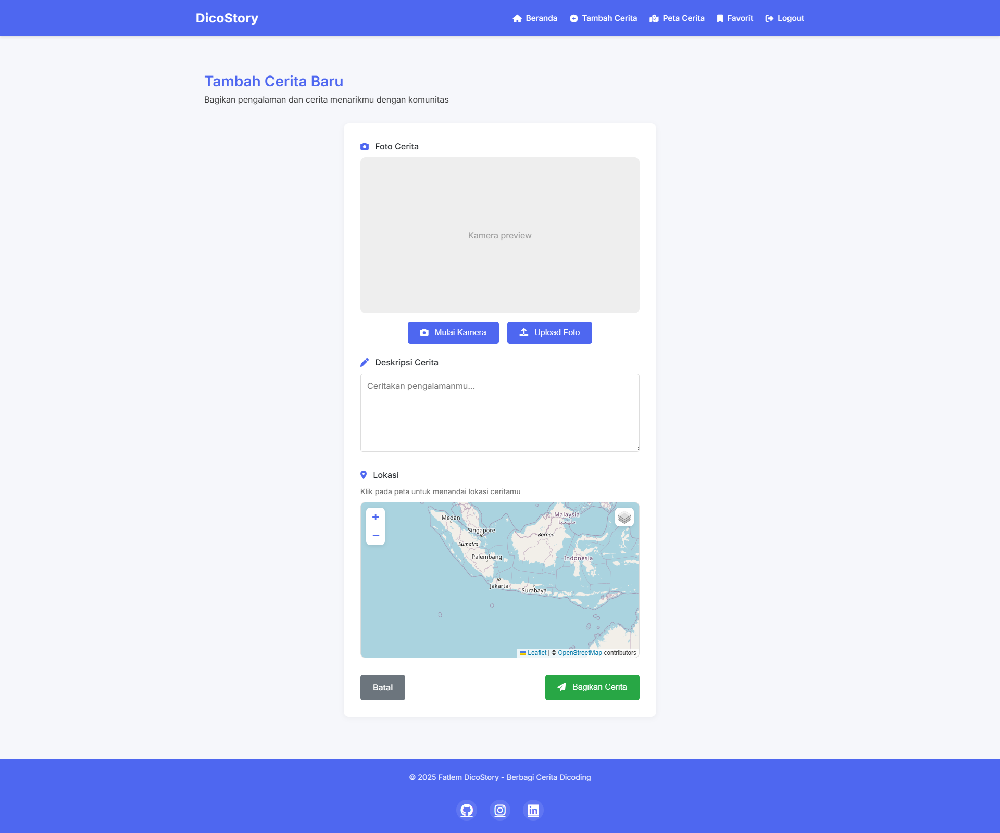
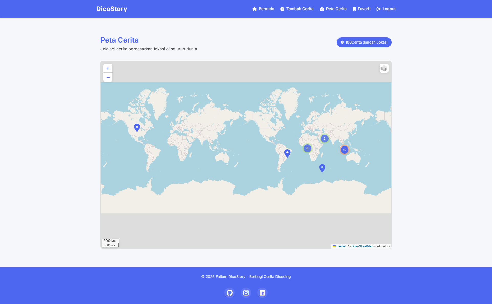

# Faathir El Tasleem - FC007D5Y1704

## 🚀 DicoStory - Aplikasi Berbagi Cerita Dicoding

DicoStory adalah aplikasi progressive web app (PWA) untuk berbagi cerita dalam bentuk teks dan gambar dengan lokasi. Aplikasi ini dirancang dengan fokus pada pengalaman pengguna, performa, dan aksesibilitas.

### 📌 **Catatan Penting**
Aplikasi ini menggunakan layanan peta dari **Leaflet** dengan **OpenStreetMap** sebagai provider.  
Tidak perlu API key khusus karena OpenStreetMap bersifat **gratis dan open source**.

#### 🌍 Untuk basemap tambahan:
- **Satellite View** - ArcGIS (tidak memerlukan API key untuk penggunaan dasar)
- **Topographic View** - OpenTopoMap (tidak memerlukan API key)

#### 🔔 Layanan push notification menggunakan API dari Dicoding dengan VAPID public key:
`BCCs2eonMI-6H2ctvFaWg-UYdDv387Vno_bzUzALpB442r2lCnsHmtrx8biyPi_E-1fSGABK_Qs_GlvPoJJqxbk`

---

### 🛠 **Fitur Aplikasi**

#### 🌟 Fitur Utama
1. **Arsitektur Single-Page Application (SPA)**
   - Menggunakan teknik hash (#) untuk routing
   - Mengimplementasikan pola **Model-View-Presenter (MVP)**

2. **Menampilkan Data**
   - Daftar cerita dengan gambar dan informasi pada halaman utama
   - Detail cerita dalam modal tanpa menampilkan ID di URL
   - Peta digital untuk menampilkan lokasi cerita

3. **Menambah Data Baru**
   - Form untuk menambahkan cerita baru
   - Pengambilan gambar dengan kamera
   - Pemilihan lokasi dengan peta

4. **Aksesibilitas**
   - Skip to content link
   - Teks alternatif pada gambar
   - Label pada form inputs
   - Penggunaan **semantic elements** (header, nav, main, section, footer)

5. **Transisi Halaman**
   - Implementasi **View Transition API** untuk transisi halus antar halaman

#### 🔥 Fitur Progressive Web App (PWA)
1. **Installable**
   - Dapat dipasang ke homescreen perangkat
   - Memiliki icon dan splash screen
   - Disertai shortcuts untuk navigasi cepat

2. **Offline Capability**
   - Menggunakan **Service Worker** dengan **Workbox**
   - Menyimpan aset statis untuk penggunaan offline
   - Penanganan jaringan offline dengan UI yang informatif

3. **IndexedDB**
   - Menyimpan cerita favorit untuk akses offline
   - Menambah, menampilkan, dan menghapus data favorit
   - Sinkronisasi data ketika kembali online

4. **Push Notification**
   - Notifikasi saat ada cerita baru
   - Notifikasi saat menambahkan cerita ke favorit
   - Dukungan untuk pengelolaan izin notifikasi

5. **App Shell**
   - Arsitektur App Shell untuk memisahkan UI statis dan konten dinamis
   - Loading cepat dan transisi mulus

6. **Responsive Design**
   - Tampilan yang menarik di berbagai ukuran layar
   - Mobile-friendly dengan navigasi yang optimized
   - Adaptif untuk desktop, tablet, dan smartphone

---

### 📝 **Cara Penggunaan**

1. Buka aplikasi di browser
2. Register akun baru atau login jika sudah memiliki akun
3. Di halaman utama, lihat daftar cerita yang telah dibagikan
4. Klik tombol **"Tambah Cerita"** untuk membagikan cerita baru
5. Pada halaman tambah cerita:
   - Ambil foto dengan kamera 📸
   - Isi deskripsi cerita ✍️
   - Pilih lokasi pada peta 🌍
   - Klik **"Bagikan Cerita"**
6. Klik **"Peta Cerita"** untuk melihat semua cerita dengan lokasi pada peta
7. Tambahkan cerita ke favorit untuk akses offline dengan mengklik icon bookmark
8. Pasang aplikasi ke homescreen dengan mengklik banner instalasi

---

### 🌐 **Teknologi yang Digunakan**

- **Frontend**: HTML5, CSS3, JavaScript (ES6+)
- **Routing**: Custom SPA Router
- **Storage**: IndexedDB untuk penyimpanan lokal
- **Maps**: Leaflet.js dengan OpenStreetMap
- **PWA**: Service Worker, Web App Manifest
- **Caching**: Workbox untuk strategi caching
- **UI/UX**: Custom CSS, Font Awesome, Custom Animations
- **Build Tools**: Native JavaScript (tanpa framework)

---

### 🖼 **UI/UX**

### **Lobby**

### **Register**

### **Login**

### **Home**

### **Detail**

### **AddStory**

###  **Map**

### **Offline Mode**

### **PWA Installed**

---

### 🚀 **Deployment**

Aplikasi ini di-deploy menggunakan GitHub Pages dan dapat diakses melalui:
[https://dicostory.netlify.app/](https://dicostory.netlify.app/)

---

### 📱 **PWA Features Showcase**

#### 💻 Desktop Shortcuts

#### 📱 Mobile Installation

#### 🔔 Push Notification

---

### 👨‍💻 **Developer**

Aplikasi ini dikembangkan oleh **Faathir El Tasleem** sebagai submission untuk kelas Dicoding "Membangun Progressive Web Apps".

---

### 📄 **Lisensi**

© 2025 Faathir El Tasleem - DicoStory - Berbagi Cerita Dicoding

Proyek ini adalah bagian dari pembelajaran dan tidak untuk digunakan untuk keperluan komersial tanpa izin.